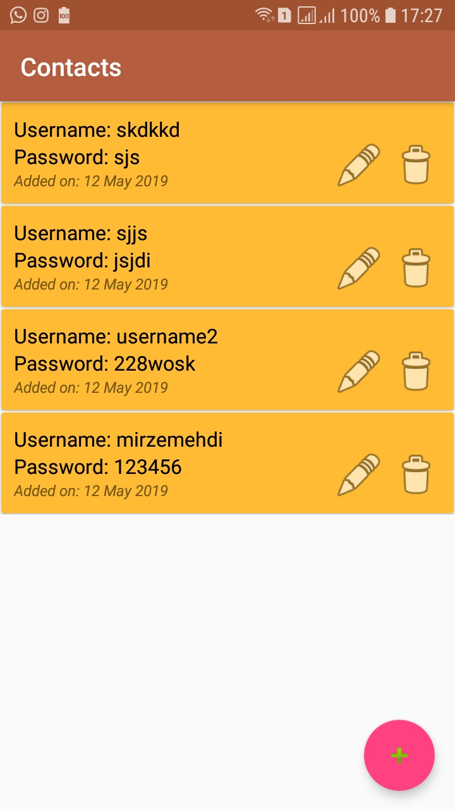

# Profiles App

 Android app  that you adds profiles with their usernames and passwords and app stores them in phone's database using  
 SQLite class for database and can share them with mail with others
 Some pictures from an app  

  
" 

### Installing
apk link:  https://github.com/mirzemehdi/contacts/raw/master/apk/contacts.apk

## Used Libraries and Classes

**SQLite** - for store datas in database(offline)  
**RecylerView** - for showing profiles in the list  
**CardView** - in list row  

## Authors

----Developed by ***Mirzamehdi Karimov***----

